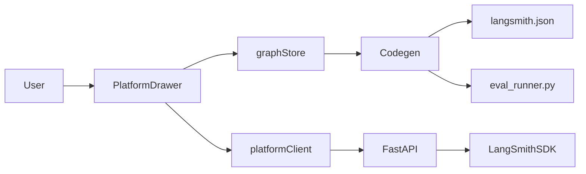
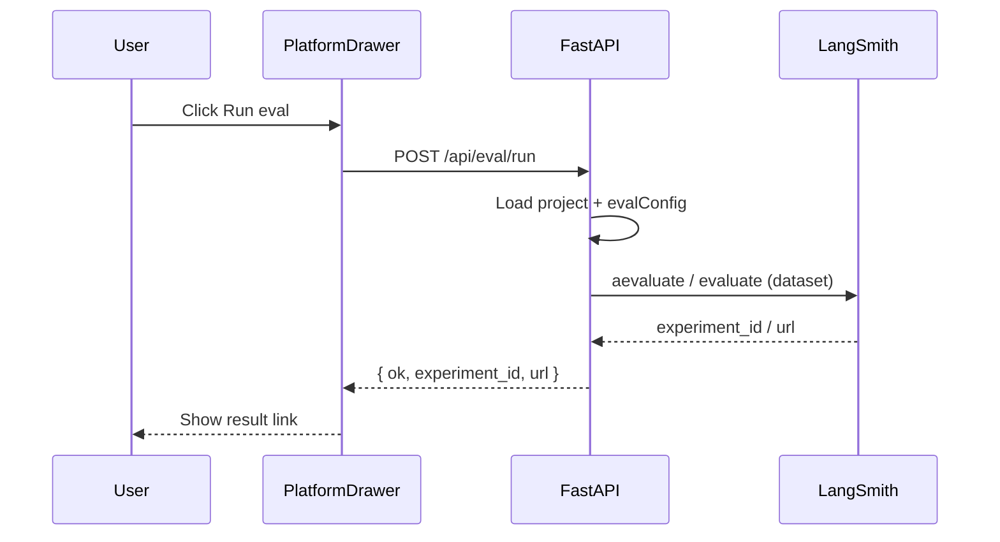
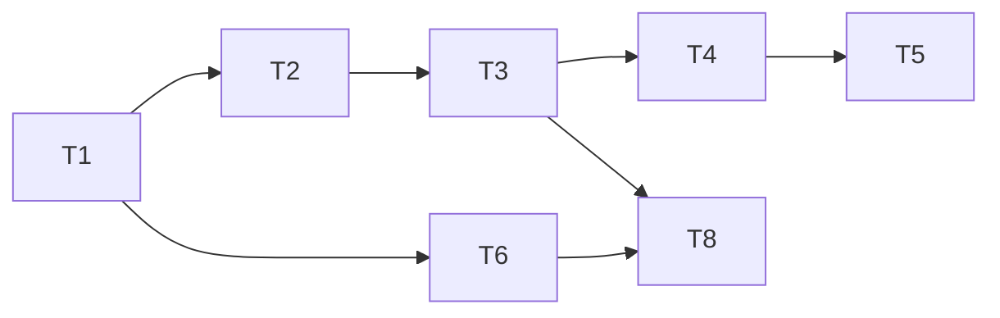

# LLD: LangSmith Eval Runner MVP

| Field | Value |
|-------|-------|
| BRD reference | `.cursor/cycles/cycle-01/BRD.md` |
| Author | feature-lld-architect |
| Status | **Ready for review** (compact mode: approved) |
| MVP target | ~3 weeks |

## 1. Summary

Add **Eval** platform tab + **`EvalConfig`** on graph document, **`POST /api/eval/run`** server route using LangSmith SDK, and **codegen** for `langsmith.json` eval section + `eval_runner.py`. Chosen approach: **platform-orchestrated eval** (server calls LangSmith against saved/exported project) rather than rebuilding Studio UI. Evaluators remain in LangSmith UI; LangStitch stores dataset reference + experiment metadata only.

## 2. Requirements traceability

| BRD FR | LLD section | Component(s) |
|--------|-------------|--------------|
| FR-1 | §7.1 | `PlatformDrawer.tsx` — Eval tab |
| FR-2 | §5.1, §5.2 | `EvalConfig`, `graphStore.updateGraphSettings` |
| FR-3 | §6.1, §4.3 | `POST /api/eval/run`, `platformClient.runEval` |
| FR-4 | §5.4 | `pythonProjectGenerator.generateLangsmithJson` |
| FR-5 | §5.4 | `pythonProjectGenerator` → `eval_runner.py` |
| FR-6 | §7.2 | Disabled state when `!observability.langsmith.enabled` |
| FR-7 | §6.1, §8 | API error responses, UI error toast/log |
| NFR-1 | §6.1 | 120s timeout, busy spinner |
| NFR-2 | §5.1 | env var names only |
| NFR-3 | §5.4 | export round-trip tests |
| NFR-4 | §7.2 | existing platform CSS |

## 3. Recommended approach & alternatives

### 3.1 Chosen approach

**Platform API + LangSmith SDK adapter** in `server/eval_runner.py`; UI in Platform drawer; config on `GraphSettings.eval`; codegen emits runnable `eval_runner.py` for CI.

### 3.2 Alternatives considered

| Option | Pros | Cons | Verdict |
|--------|------|------|---------|
| Client-only deep link to LangSmith | Zero backend | No FR-3, weak DX | Reject |
| Full eval UI in IDE | Parity with Studio | Huge scope, anti-pattern per BRD | Reject |
| Export-only (no Run API) | Smaller | Fails FR-3 | Defer slice only |

## 4. System design

### 4.1 Context



### 4.2 Sequence — Run eval



## 5. Data design

### 5.1 TypeScript — `src/types/graph.ts`

```typescript
export interface EvalConfig {
  enabled: boolean
  datasetName: string
  datasetId: string
  experimentPrefix: string
  maxConcurrency: number
  description: string
}

// GraphSettings — add:
eval: EvalConfig
```

Defaults in `src/lib/designerConstants.ts`:

```typescript
export const DEFAULT_EVAL: EvalConfig = {
  enabled: false,
  datasetName: '',
  datasetId: '',
  experimentPrefix: '',
  maxConcurrency: 2,
  description: '',
}
```

Merge in `normalizeGraphSettings` / `DEFAULT_GRAPH_SETTINGS`.

**Version:** no GraphDocument version bump; optional field with defaults on load.

### 5.2 Store — `graphStore.ts`

- Extend `updateGraphSettings` to merge `eval` slice (mirror observability pattern).
- `getProjectPayload()` includes `settings.eval` automatically via document.

### 5.3 Backend — `server/`

New module `server/eval_service.py`:
- `run_eval(project_id: str, eval_config: dict) -> EvalRunResult`
- Uses `langsmith` Client; reads `LANGCHAIN_API_KEY` from env (name from document observability.langsmith.apiKeyEnv)
- Target function: invoke saved project's exported graph entrypoint or stub runner for MVP using `runtime/basic_agent.py` pattern when project matches fixture

Models in `main.py`:

```python
class EvalConfigPayload(BaseModel):
    dataset_name: str = ""
    dataset_id: str = ""
    experiment_prefix: str = ""
    max_concurrency: int = 2
    description: str = ""

class EvalRunRequest(BaseModel):
    project_id: str
    eval_config: EvalConfigPayload
    langsmith_project: str
    api_key_env: str = "LANGCHAIN_API_KEY"
```

### 5.4 Export / codegen impact

**`generateLangsmithJson`** — add:

```json
"eval": {
  "enabled": true,
  "dataset_name": "...",
  "dataset_id": "...",
  "experiment_prefix": "...",
  "max_concurrency": 2
}
```

**New file in Python export:** `{slug}/eval_runner.py`
- Reads `langsmith.json`
- `--dry-run` validates config
- Otherwise calls `langsmith.evaluate` with project entrypoint

**Files touched:**
- `src/lib/codegen/pythonProjectGenerator.ts`
- `src/lib/codegen/pythonGenerator.ts` (optional comment in header)

## 6. API design

| Method | Path | Request | Response | Errors |
|--------|------|---------|----------|--------|
| POST | `/api/eval/run` | `EvalRunRequest` | `{ ok, experiment_id?, url?, message? }` | 400 missing dataset, 401 no API key, 504 timeout |

- Timeout: 120s via subprocess or asyncio.wait_for
- No API key in request body — env only

## 7. UI / UX design

### 7.1 Surfaces

- `PlatformDrawer.tsx`: new tab `'eval'`, icon `FlaskConical` or `TestTube2`
- `GraphDesigner.tsx`: optional read-only summary under observability ("Eval dataset: …") — phase 2 optional; MVP in Platform only

### 7.2 Behavior

- **Disabled:** when `!settings.observability.langsmith.enabled` → hint + link to Graph Designer observability
- **Form fields:** dataset name, dataset ID (optional if name set), experiment prefix, max concurrency, description
- **Run eval:** disabled when busy or dataset empty
- **Result:** append to platform log + show experiment URL if returned

### 7.3 data-testid (automation)

| testid | Element |
|--------|---------|
| `platform-tab-eval` | Eval tab button |
| `eval-panel` | Tab content root |
| `eval-dataset-name` | Dataset name input |
| `eval-dataset-id` | Dataset ID input |
| `eval-experiment-prefix` | Prefix input |
| `eval-run-button` | Run eval CTA |
| `eval-result` | Result message area |
| `eval-disabled-hint` | LangSmith disabled message |

## 8. Cross-cutting concerns

| Concern | Decision |
|---------|----------|
| Errors | `{ ok: false, message: "..." }` + HTTP 4xx |
| Security | No secrets in repo; validate project_id path |
| Performance | max_concurrency cap 8 |
| Logging | Platform log + server stdout |

## 9. Testing strategy

| Level | Scope | Key cases |
|-------|-------|-----------|
| Unit | eval config merge | DEFAULT_EVAL on load |
| API | POST /api/eval/run | 400 no dataset, 401 no key (mock) |
| E2E | `e2e/eval-runner.spec.ts` | tab visible, disabled state, form save, dry-run API mock |
| Export | EXP-CHK | langsmith.json eval block, eval_runner.py exists |

## 10. Rollout

- README: Eval Runner setup
- `site/index.html#compare` — update eval row
- `server/requirements.txt` — add `langsmith>=0.2.0`

## 11. Risks

| Risk | Mitigation |
|------|------------|
| LangSmith SDK not installed | requirements.txt + clear error |
| Long eval | 120s timeout + message to open LangSmith |

## 12. Implementation plan

| ID | Task | Depends | Size |
|----|------|---------|------|
| LLD-T1 | Types + defaults (`EvalConfig`) | — | S |
| LLD-T2 | graphStore merge for eval | T1 | S |
| LLD-T3 | Platform Eval tab UI | T2 | M |
| LLD-T4 | platformClient.runEval | T3 | S |
| LLD-T5 | server eval_service + route | T4 | M |
| LLD-T6 | Codegen langsmith.json + eval_runner.py | T1 | M |
| LLD-T7 | GraphDesigner summary (optional) | T2 | S |
| LLD-T8 | E2E + docs + compare page | T3–T6 | M |



## 13. Open questions

1. ~~SDK in server vs subprocess~~ → **server venv** with langsmith in requirements.txt
2. Dataset lookup by name via API if ID empty — **MVP: require at least dataset_name**

## 14. Definition of done (technical)

- [ ] FR-1–FR-7 traceable to merged code
- [ ] Export round-trip includes eval config
- [ ] E2E covers Eval tab primary flow
- [ ] No regression in existing Playwright suite
- [ ] `npm run build` green
