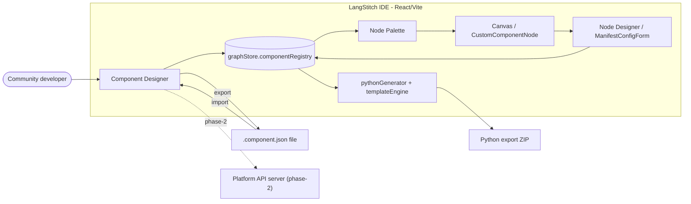
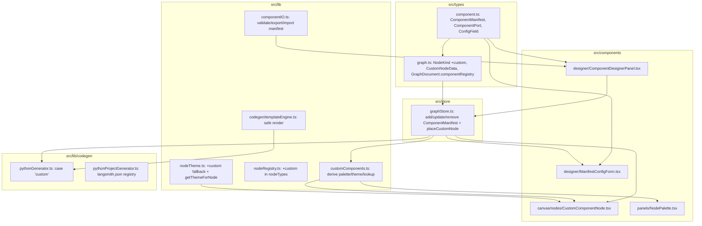
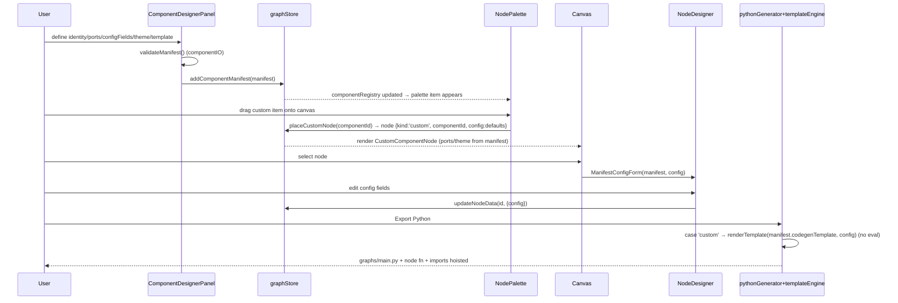
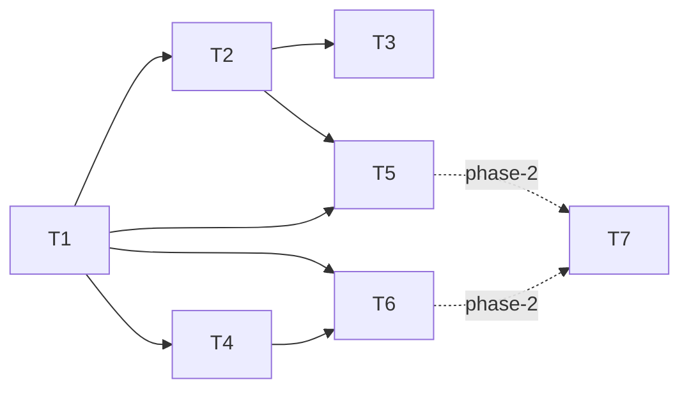

# LLD: SDK Component Designer (custom nodes, connectors & adaptors)

| Field | Value |
|-------|-------|
| BRD reference | `.cursor/cycles/cycle-141/BRD.md` — SDK Component Designer (community-extensible custom components) |
| Author | feature-lld-architect |
| Status | Approved (user approved full MVP T1–T6) |
| MVP target | ~3 weeks (6 vertical slices, LLD-T1..T6) |
| Cycle | 141 |

---

## 1. Summary

We add a **manifest-driven custom component system** that runs **alongside** the existing hardcoded node kinds without touching them. A *component* is a declarative `ComponentManifest` (identity, ports, a typed `configFields` schema, a visual theme, and a safe Python `codegenTemplate`) stored in a new `GraphDocument.componentRegistry` array. Placed instances use a **single new closed-union `NodeKind` `'custom'`** whose `CustomNodeData` carries `componentId` + a `config` bag — so the union stays exhaustive, defaults remain compiled the same way, and adding a component requires **zero new source files**.

One **generic React renderer** (`CustomComponentNode.tsx`) draws every custom node from its manifest (ports, theme, summary), one **generic manifest-driven property form** renders in the Node Designer, the **palette merges built-ins with registry-derived items**, and codegen gains **exactly one new `switch` case** that renders the manifest template through a **safe string-substitution engine (no `eval`/`Function`)**. MVP distribution is a portable single-component **`.component.json`** export/import with collision handling. Phase-2 hooks (defaults migration, PyPI/npm packages, marketplace install API) are sketched but out of scope.

**Key trade-off accepted:** MVP custom nodes use a *generic* renderer + a *string-template* codegen contract (not arbitrary JS/Python). This guarantees NFR-4 (no arbitrary code execution in the IDE) and keeps the blast radius to ~2 added switch/registry entries, at the cost of pixel-perfect bespoke node visuals (deferred to phase-2 theme tokens).

---

## 2. Requirements traceability

| BRD FR | LLD section | Component(s) |
|--------|-------------|--------------|
| FR-1 Visual creation, no manual file edits | §7.4, §4.3, §5.2 | `ComponentDesignerPanel`, `graphStore` component CRUD |
| FR-2 Manifest declares id/label/category/icon/theme/ports/configFields/template | §5.1 | `ComponentManifest` (`src/types/component.ts`) |
| FR-3 Custom components in palette + drag/drop | §7.5, §4.2 | `NodePalette`, `AppLayout.onDrop`, `customComponents.ts` |
| FR-4 Auto-generated property form on selection | §7.6 | `NodeDesigner` → `ManifestConfigForm` |
| FR-5 Participate in Python export/codegen | §5.4, §6-codegen | `pythonGenerator.generateNodeFunction` (custom case), `templateEngine.ts` |
| FR-6 Survive project round-trip | §5.1, §5.2, §5.5 | `componentRegistry` on `GraphDocument`, `loadProject`, `exportGraphDocument` |
| FR-7 Portable JSON manifest export/import | §7.7, §5.6 | `componentIO.ts`, Component Designer import/export buttons |
| FR-8 Defaults unchanged (additive) | §3.1, §5.1, §8 | closed-union `'custom'` kind only; all default cases intact |
| FR-9 (phase-2) Connectors/adaptors categories | §5.1 (`category`), §10 | `category` field present in MVP; specialized behavior deferred |
| FR-10 (phase-2) Package + marketplace distribution | §6 (sketch), §10 | new `/api/components/*` endpoints (sketch only) |
| NFR-1 No regression | §8, §9 | additive design, full existing Playwright suite kept green |
| NFR-2 TS strict, React 19, minimal diff | all | extend existing patterns |
| NFR-3 Export is the contract | §5.4 | round-trip + `langsmith.json` registry entry |
| NFR-4 Safe templating, no code exec | §5.4, §8 | `templateEngine.ts` whitelist substitution |
| NFR-5 Versioned migration | §5.5 | GraphDocument `1.2`, `loadProject` defaulting |

---

## 3. Recommended approach & alternatives

### 3.1 Chosen approach — "one `custom` kind + manifest registry"

- Add **one** value to the closed `NodeKind` union: `'custom'` (`src/types/graph.ts`).
- Add `CustomNodeData` (`kind: 'custom'`, `componentId: string`, `config: Record<string, unknown>`) to the `StitchNodeData` union.
- Add `GraphDocument.componentRegistry: ComponentManifest[]`.
- One generic node component (`customNode`) registered once in `GraphCanvas.tsx` + `nodeRegistry.nodeTypes`.
- One generic Node Designer form branch (`data.kind === 'custom'`).
- One generic codegen `switch` case (`case 'custom':`).
- Palette + drag/drop derive custom entries from `componentRegistry` at runtime.

**Why:** keeps TypeScript exhaustiveness (the compiler still forces every default case to exist), leaves every existing `switch (data.kind)`/`NODE_THEMES`/`nodeTypes` entry **byte-for-byte unchanged**, and makes "add a component" a pure data operation (no files, no rebuild). It directly satisfies the *additive-first* locked decision and FR-8.

### 3.2 Alternatives considered

| Option | Pros | Cons | Verdict |
|--------|------|------|---------|
| **A. Parallel dynamic-kind union** (allow `NodeKind = …​ | string`, register arbitrary kind strings) | Each component feels like a first-class kind | Breaks closed-union exhaustiveness → every `switch` loses compile-time safety; `Record<NodeKind, …>` maps (themes, nodeTypes) become impossible to type; high regression risk to defaults | **Rejected** (violates NFR-1/NFR-2) |
| **B. One `custom` kind + `componentId` (chosen)** | Closed union intact, minimal diff, zero new files per component, defaults untouched | Custom nodes share one React type + one codegen case (generic, not bespoke) | **Chosen** |
| **C. Manifests describe ALL nodes now (converge immediately)** | Single unified model (the long-term vision) | Rewrites every default node/codegen path → massive blast radius, contradicts locked "additive-first" | **Rejected for MVP**, scheduled as phase-2 |
| Codegen: **JS template function / Python in browser** | Most flexible | Arbitrary code execution in IDE → violates NFR-4 | **Rejected** |
| Codegen: **whitelisted string substitution (chosen)** | Safe, deterministic, testable | Limited expressiveness (mitigated by `code` config fields) | **Chosen** |

---

## 4. System design

### 4.1 Context diagram



### 4.2 Component diagram



### 4.3 Sequence — author, place, export a custom component



---

## 5. Data design

### 5.1 TypeScript types

**New file `src/types/component.ts`:**

```typescript
// src/types/component.ts
export type ComponentCategory = 'node' | 'connector' | 'adaptor'

export type ConfigFieldKind =
  | 'string'
  | 'number'
  | 'boolean'
  | 'select'
  | 'code'      // multiline; rendered as <textarea class="code">; emitted verbatim
  | 'secret'    // never inlined into code; emitted as os.environ.get(<value>)
  | 'json'      // validated JSON string

export interface ConfigFieldOption {
  value: string
  label: string
}

export interface ConfigField {
  id: string                 // unique within manifest; slug [a-z0-9_]; used as {{field.<id>}}
  label: string
  kind: ConfigFieldKind
  required?: boolean
  defaultValue?: string | number | boolean
  placeholder?: string
  hint?: string              // shown under the label (ui hint)
  options?: ConfigFieldOption[] // for kind === 'select'
  // validation (all optional; enforced in form + on import)
  min?: number               // number
  max?: number               // number
  pattern?: string           // string/code regex (source string; compiled safely)
  language?: 'python' | 'json' | 'text' // code editor hint
}

export type PortSide = 'left' | 'right'
export type PortMultiplicity = 'single' | 'multi'

export interface ComponentPort {
  id: string                 // slug; becomes React Flow handle id
  label: string
  side: PortSide             // left = target/input, right = source/output
  multiplicity: PortMultiplicity
}

export interface ComponentTheme {
  color: string              // hex; drives accent/border
  colorLight: string
  icon: string               // lucide icon name (mapped via ICON_MAP; fallback 'box')
  typeLabel: string          // badge text on the node
}

export interface ComponentCodegen {
  /**
   * Safe template. Allowed placeholders ONLY (see §5.4):
   *  {{label}} {{nodeName}} {{description}} {{outputKey}}
   *  {{field.<id>}}        -> escaped per field kind
   *  {{field.<id>.raw}}    -> raw (code fields only)
   * Must define a function `def {{nodeName}}(state: State) -> dict:` returning a dict.
   */
  template: string
  imports?: string[]         // python import lines, deduped + hoisted to module top
  dependencies?: string[]    // pip names recorded in manifest (phase-2 surfaces in pyproject)
  async?: boolean            // emit `async def` (mirrors existing a2a pattern)
}

export interface ComponentManifest {
  schemaVersion: '1.0'       // manifest schema, independent of GraphDocument version
  id: string                 // stable unique id, slug; referenced by CustomNodeData.componentId
  label: string
  category: ComponentCategory
  description: string
  ports: ComponentPort[]
  configFields: ConfigField[]
  theme: ComponentTheme
  codegen: ComponentCodegen
  author?: string
  version?: string           // semver of the component itself
}
```

**Changes to `src/types/graph.ts`:**

```typescript
// 1) extend the closed union (one new value — defaults untouched)
export type NodeKind =
  | 'start' | 'end' | 'llm' | 'tool' | 'router' | 'function'
  | 'subgraph' | 'agent' | 'rag' | 'intent_classifier'
  | 'custom'                                   // NEW

// 2) generic data carrier for any manifest-driven node
export interface CustomNodeData extends BaseNodeData {
  kind: 'custom'
  componentId: string                         // → GraphDocument.componentRegistry[].id
  config: Record<string, unknown>             // keyed by ConfigField.id
  outputKey?: string                          // optional convenience for {{outputKey}}
}

// 3) add to the StitchNodeData union
export type StitchNodeData =
  | StartNodeData | EndNodeData | LLMNodeData | ToolNodeData | RouterNodeData
  | FunctionNodeData | SubgraphNodeData | AgentNodeData | RagNodeData
  | IntentClassifierNodeData
  | CustomNodeData                             // NEW

// 4) registry on the document (version bumped)
export interface GraphDocument {
  version: '1.0' | '1.1' | '1.2'              // bump
  // …​ all existing keys unchanged …
  componentRegistry: ComponentManifest[]      // NEW (import ComponentManifest)
}
```

**Node referencing decision (justification):** a placed node is `{ kind: 'custom', componentId, config }`. The *visual/codegen identity* comes from the manifest resolved via `componentId`, **not** from the kind. This is option **B** in §3.2 — chosen because it keeps the closed union and every default `switch`/`Record<NodeKind,…>` exactly as-is (FR-8/NFR-1), while still allowing unlimited component types with no per-component files.

### 5.2 Store (Zustand) changes — `src/store/graphStore.ts`

Mirror the existing registry CRUD pattern (e.g. `addToolDefinition`). Add to the `GraphStore` interface and implementation:

```typescript
// component registry CRUD (mirrors addToolDefinition etc.)
addComponentManifest: (m: ComponentManifest) => void
updateComponentManifest: (id: string, patch: Partial<ComponentManifest>) => void
removeComponentManifest: (id: string) => void        // guarded: see below
// convenience: build a placed node from a manifest with default config
placeCustomNode: (componentId: string, position: { x: number; y: number }) => void
```

- `addComponentManifest`/`update`/`remove` follow the exact `set({ document: { ...get().document, componentRegistry: [...] } })` shape used by `addToolDefinition`.
- `removeComponentManifest(id)`: count placed instances (`nodes` across `canvasByGraph` where `data.kind === 'custom' && data.componentId === id`). If any exist, the Designer surfaces a confirm + count; deletion still allowed (orphan nodes render via a fallback "missing component" shell — see §8 Errors). Removal does **not** auto-delete placed nodes.
- `placeCustomNode` builds default `config` from `manifest.configFields` (`defaultValue` per kind) and calls the existing `addNode` (so undo history + canvas sync are reused). `type` is `'customNode'`.
- `selectNode`/`updateNodeData` already handle arbitrary `Partial<StitchNodeData>` — config edits go through `updateNodeData(id, { config: nextConfig })` (deep-merge handled in the form, since `updateNodeData` does a shallow `{...n.data, ...data}`).

### 5.3 Backend models — `server/`

MVP requires **no new backend route**. The only backend change is the persistence whitelist:

```python
# server/main.py — DOCUMENT_KEYS
DOCUMENT_KEYS = {
    "version", "name", "description", "stateFields", "subgraphs", "activeSubgraphId",
    "settings", "remoteGraphs", "toolRegistry", "agentRegistry", "mcpServers",
    "skillRegistry", "guardrailRegistry", "businessRuleRegistry", "personaRegistry", "ragPipelines",
    "componentRegistry",   # NEW — persists/syncs custom components server-side
}
```

This makes `componentRegistry` survive `/api/project/save`, `/api/git/sync`, `/api/import`, and version restore (all use `extract_document`). Phase-2 marketplace endpoints are sketched in §6.

### 5.4 Export / codegen impact

**Files emitted:** unchanged set. Custom node functions are emitted into the monolith `graphs/main.py` via the new `case 'custom'` in `generateNodeFunction`, and a stub per-node file in `nodes/<fn>.py` (existing `generateNodeModules` already handles any non-start/end node generically — no change needed there).

**Safe template engine — new file `src/lib/codegen/templateEngine.ts`:**

```typescript
// Allowed top-level tokens (whitelist). Anything else → render error.
// {{label}} {{nodeName}} {{description}} {{outputKey}}
// {{field.<id>}}  {{field.<id>.raw}}
const TOKEN = /\{\{\s*([a-zA-Z0-9_.]+)\s*\}\}/g

export interface RenderContext {
  nodeName: string
  label: string
  description: string
  outputKey: string
  fields: Record<string, { kind: ConfigFieldKind; value: unknown }>
}

export function renderTemplate(template: string, ctx: RenderContext): { code: string; errors: string[] }
```

Rules (deterministic, **no `eval`/`new Function`**):
- Pure regex replace. Each token resolved against a fixed context object; unknown token → push to `errors[]` and replace with `# UNRESOLVED:<token>` comment (export still produces a file; UI shows the error).
- **Escaping by field kind:**
  - `string`/`select` → `JSON.stringify(value)` (safe Python string literal; identical to how existing generators emit prompts).
  - `number`/`boolean` → numeric / `True`/`False`.
  - `json` → validated, then inlined as a Python literal via `JSON.stringify`-of-parsed (objects become dict literals; we emit the JSON text which is valid Python for the dict/list/scalar subset, matching existing `inputMapping` usage).
  - `secret` → **never inlined**; `{{field.<id>}}` expands to `os.environ.get(<JSON.stringify(value)>)` and forces `import os`.
  - `code` → `{{field.<id>}}` is line-escaped into a string literal; `{{field.<id>.raw}}` injects the code **verbatim**, re-indented to the placeholder's column (the only "raw" path, available to `code` fields only — this is data the author typed, never executed in the IDE).
- Imports: `manifest.codegen.imports` are collected across all custom nodes, deduped, and hoisted next to the existing `import os` / `from langgraph.graph import …` block in `generatePythonCode`.
- Async: if `manifest.codegen.async`, the template must define `async def`; graph wiring is unchanged (LangGraph supports async node callables, mirroring the existing a2a `async def` case).

**`generateNodeFunction` new case** (additive; all existing cases intact):

```typescript
case 'custom': {
  const manifest = componentRegistry.find((c) => c.id === data.componentId)
  if (!manifest) {
    return `def ${fnName}(state: State) -> dict:\n    """Missing component: ${data.componentId}"""\n    return {}\n`
  }
  const { code } = renderTemplate(manifest.codegen.template, buildCtx(node, manifest))
  return code.endsWith('\n') ? code : code + '\n'
}
```

`generateNodeFunction`/`generatePythonCode` gain a `componentRegistry` parameter (threaded from `doc.componentRegistry ?? []`, same way `toolRegistry`/`agentRegistry` are passed). **Graph wiring (`generateGraphBuilder`) needs no change** — custom nodes are treated as ordinary nodes (`add_node` + linear edges); they are not routers, so they flow through the existing non-router edge path.

**`langsmith.json` impact** (`pythonProjectGenerator.generateLangsmithJson`): add `components: (doc.componentRegistry ?? []).map(c => c.id)` to the `registries` object and bump `langstitch.schema_version` to `'1.2'`. This is additive and preserves backward compatibility with prior exports (older bundles simply lack the key).

**Round-trip:** `exportGraphDocument` serializes the whole `doc` via spread (`{ ...doc, … }`), so `componentRegistry` and `config`-bearing nodes are already included. `loadProject` restores them (see §5.5).

### 5.5 GraphDocument versioning + migration

- Bump `createDefaultDocument()` to `version: '1.2'` and add `componentRegistry: []`.
- `loadProject` adds one defaulting line in the normalization block (next to `toolRegistry: document.toolRegistry ?? []`):

```typescript
componentRegistry: document.componentRegistry ?? [],
```

- **Old `.langstitch.json` (v1.0/v1.1):** load unchanged; `componentRegistry` defaults to `[]`; no custom nodes exist, so nothing references it. No destructive migration. Version string is read but not gated (the union accepts `'1.0' | '1.1' | '1.2'`).
- **Forward compat:** a v1.2 file opened by older builds is harmless except custom nodes won't render — acceptable; we only ship forward.

### 5.6 Portable manifest schema (`.component.json`)

A single component file is exactly one `ComponentManifest` JSON object plus a wrapper for provenance:

```json
{
  "langstitchComponent": "1.0",
  "exportedAt": "2026-06-26T00:00:00Z",
  "manifest": { /* ComponentManifest */ }
}
```

Import validates `langstitchComponent` and the embedded `manifest` (see §7.7 collision handling).

---

## 6. API design (Platform API)

**MVP: no new endpoints.** Custom components persist through existing `/api/project/save` + `/api/import` + git sync because they live inside `GraphDocument` (whitelisted in §5.3). Portable `.component.json` import/export is **fully client-side** (browser file read/`downloadBlob`), reusing the pattern in `platformClient.downloadBlob`.

**Phase-2 sketch only (not built in this cycle):**

| Method | Path | Request | Response | Errors |
|--------|------|---------|----------|--------|
| GET | `/api/components` | `?category=&q=` | `{ components: ComponentManifest[] }` | 401 |
| GET | `/api/components/{id}` | — | `ComponentManifest` | 404 |
| POST | `/api/components/install` | `{ project_id, component_id }` | `{ ok, manifest }` | 404, 409 |
| POST | `/api/components/publish` | `{ manifest }` | `{ ok, id }` | 400, 401, 409 |

These would live in a new `server/components.py` router mirroring `server/marketplace.py`, reusing the request-scoped user id for ownership. PyPI/npm packaging would emit a manifest + generated Python adapter into a publishable folder (reusing `pythonProjectGenerator` conventions and the existing SDK `Registry`/`add_loader` hook in `sdk/src/langstitch/registry.py`). **All deferred.**

---

## 7. UI / UX design

### 7.1 Surfaces touched
- **Designer sidebar**: new 4th tab **"Components"** in `DesignerPanel.tsx` (`designerTab` extended to `'node' | 'graph' | 'assets' | 'components'`).
- **Node Designer**: new generic branch for `data.kind === 'custom'` (`ManifestConfigForm`).
- **Node Palette**: a "Custom Components" group appended below built-ins.
- **Canvas**: new `customNode` React type rendering `CustomComponentNode`.

### 7.2 Recommendation — where the Component Designer lives
**Recommend: a new Designer tab "Components"** (not the Platform drawer). Rationale: authoring a component is a *design* activity that lives next to Node/Graph/Assets designers, uses the same `Section`/`Field` primitives, and benefits from the always-visible sidebar + live canvas preview. The Platform drawer is for **ops** (git/build/deploy/export) per design principle 3; installing from a future marketplace belongs there in phase-2, but *authoring* belongs in the designer.

### 7.3 Wire-level behavior
- Entry point: click **Components** tab → list of existing manifests + **"+ New component"** button (mirrors `AssetDesignersPanel` add buttons).
- Empty state: friendly card ("No custom components yet — build a reusable node, connector, or adaptor").
- Loading/error: validation errors render inline (`field-error` class, like `guardrail-validation-error`); template render errors show a preview banner.
- Keyboard: standard tab/focus order; no new global shortcut (avoids clashing with existing Ctrl/Alt map in `GraphCanvas`/`AppLayout`).
- Theme: reuse `src/index.css` tokens, `designer-section`, `field`, `input`, `textarea code`, `btn-secondary-sm`, `btn-danger-sm`.

### 7.4 Component Designer form (`ComponentDesignerPanel.tsx`)
Sections (each a `Section`):
1. **Identity** — id (slug, auto from label, immutable after first save), label, category (`node|connector|adaptor` select), description, icon (select from `ICON_MAP` keys), version, author.
2. **Theme** — color + colorLight (color inputs), typeLabel (badge text). Live swatch.
3. **Ports** — repeatable rows (id, label, side `left|right`, multiplicity `single|multi`) with add/remove (branch-editor pattern from `NodeDesigner`).
4. **Config fields** — repeatable rows (id, label, kind select, required, defaultValue, options for select, validation min/max/pattern, hint).
5. **Codegen** — `template` (textarea code), `imports` (one per line), `dependencies` (comma list), `async` checkbox. A **"Placeholders" helper** lists allowed tokens.
6. **Live preview** — a read-only `CustomComponentNode` render + a "Preview generated Python" panel running `renderTemplate` against default config (shows escaping + errors).
7. Footer: **Export `.component.json`**, **Delete**, validity badge.

### 7.5 Palette + drag/drop merge
- `src/lib/customComponents.ts` exposes `customPaletteItems(registry): CustomPaletteItem[]` where each item carries `componentId`, label, description, theme.
- `NodePalette.tsx` renders built-in `paletteItems` (unchanged) then a **"Custom Components"** sub-header mapping `customPaletteItems(document.componentRegistry)`. Drag sets `DRAG_MIME` to a custom payload: for built-ins the data is the `NodeKind` string (unchanged); for custom we encode `custom:<componentId>`.
- `AppLayout.onDrop` and `NodePalette.handleQuickAdd`: if the dragged value starts with `custom:`, call `placeCustomNode(componentId, position)`; otherwise existing `createNodeData(kind)` path runs unchanged. `nodeTypes['custom'] = 'customNode'` is added to `nodeRegistry.ts`.

### 7.6 Generic property form (`ManifestConfigForm.tsx`)
- Rendered from `NodeDesigner` when `data.kind === 'custom'`. Resolves the manifest from `document.componentRegistry` by `data.componentId`.
- For each `ConfigField`, render the matching control reusing existing `Field`:
  - `string` → `input`; `number` → `input type=number` (min/max); `boolean` → `designer-check`; `select` → `select` with options; `code`/`json` → `textarea code`; `secret` → `input type=password` (stores env var name, not the secret value — emitted as `os.environ.get(...)`).
  - Validation messages inline (`field-error`).
- Identity (label/description) reuses the same generic Identity section already in `NodeDesigner`.
- Missing manifest → "This component was removed from the project" notice + button to delete the node.

### 7.7 Manifest portability (MVP)
- **Export**: in Component Designer, "Export `.component.json`" serializes `{ langstitchComponent, exportedAt, manifest }` and triggers `downloadBlob`.
- **Import**: file input in the Components tab (and a global "Import component" affordance). Read → parse → `validateManifest`:
  - **Collision (same `id` exists):** prompt **Replace** / **Import as copy** (new id `id_copy_<base36>` + label suffix) / **Cancel**. Default suggestion = "Import as copy" to protect placed instances.
  - **Invalid schema:** reject with a precise error (missing field, bad port side, duplicate field id, unknown icon → falls back to `box` with a warning).
- `componentIO.ts` owns validation + (de)serialization; shared by import flow and by `validateManifest` in the designer save path.

---

## 8. Cross-cutting concerns

| Concern | Design decision |
|---------|-----------------|
| **Safe templating (NFR-4)** | `templateEngine.ts` = whitelist regex substitution only; no `eval`/`new Function`/dynamic import; `code.raw` injects author-typed text but is never executed in-browser; secrets emit `os.environ.get`, never literals. |
| **Validation** | `componentIO.validateManifest`: slug ids, unique field/port ids, select requires ≥1 option, number min≤max, regex `pattern` compiled in try/catch (bad pattern → warning, not crash), template must contain a `def {{nodeName}}` (or `async def`). Form blocks save on hard errors. |
| **Errors** | Missing manifest at render → fallback "missing component" node shell (greyed, warning icon) + codegen emits a `"""Missing component"""` stub returning `{}` (keeps export valid). Render errors surfaced in preview + non-blocking export with `# UNRESOLVED` comments. |
| **Path traversal / injection** | No filesystem paths from manifests reach the server (manifests are JSON inside the document). Import is client-side parse; server only ever stores whitelisted document keys. Codegen escapes all interpolations. |
| **Logging** | Reuse client console only for IDE; server unchanged. No secrets logged (secret fields store env var *names*). |
| **Performance** | Palette derives custom items via a memoized selector; `CustomComponentNode` is `memo`-wrapped and reads only its manifest (resolved once per render via a `useMemo` over `componentRegistry`). Canvas re-render bounds unchanged — custom nodes use the same `BaseNodeShell`. Template rendering happens only on export/preview, not per keystroke on canvas. |
| **Accessibility** | Generated form controls use existing `Field` (label-wrapped inputs), preserving focus order and labels; color pickers have text hex inputs; icon select is a native `<select>`; new tab button keyboard-focusable like existing designer tabs. |
| **i18n** | N/A (app is single-locale today). |

**Theme resolution safety:** `nodeTheme.ts` currently does `NODE_THEMES[kind]` (total over `NodeKind`). Add a `custom` base entry to keep the `Record<NodeKind, NodeTheme>` total, plus a `getThemeForNode(node)` helper that, for `kind === 'custom'`, overlays the manifest theme (color/icon/typeLabel) on the base. `getNodeColor` (used by minimap) already has a string fallback; extend it to read `componentRegistry` is **not** required for MVP (minimap uses the base custom color) — acceptable.

---

## 9. Testing strategy

| Level | Scope | Key cases |
|-------|-------|-----------|
| **Unit** | `templateEngine.renderTemplate` | string/number/bool/select/json/secret/code escaping; `.raw` re-indent; unknown token → error + `# UNRESOLVED`; secret → `os.environ.get`; async def |
| **Unit** | `componentIO.validateManifest` | valid manifest; duplicate field id; bad port side; select w/o options; min>max; bad regex; missing `def {{nodeName}}` |
| **Unit** | `customComponents.customPaletteItems` | maps registry → items; empty registry → [] |
| **Unit** | `graphStore` | add/update/remove manifest; `placeCustomNode` builds default config; remove with placed instances reports count |
| **Unit** | `pythonGenerator` | `case 'custom'` emits function; missing manifest stub; imports hoisted/deduped; **all existing default snapshots unchanged** (regression guard) |
| **Unit** | `loadProject` migration | v1.0/v1.1 doc → `componentRegistry: []`; v1.2 round-trips custom node `config` |
| **Integration** | export bundle | `buildExportBundle` includes custom node fn in `graphs/main.py`; `langsmith.json.registries.components` populated; round-trip import restores manifest + nodes |
| **Integration** | server | `extract_document` keeps `componentRegistry` through save/import/restore |
| **E2E (Playwright)** | author→place→configure→export | create component in Components tab; drag to canvas; edit config; open code panel; verify generated `def` text |
| **E2E** | portability | export `.component.json`, re-import into fresh project, collision "import as copy" |
| **E2E (regression)** | existing suite | full current Playwright suite stays green (NFR-1) |

**New `data-testid` hooks to add:**
- Tab: `designer-tab-components`
- Panel root: `component-designer`
- Actions: `component-add`, `component-export-<id>`, `component-import-input`, `component-remove-<id>`
- Fields: `component-id-<id>`, `component-label-<id>`, `component-category-<id>`, `component-template-<id>`, `component-add-port`, `component-add-field`
- Validation: `component-validation-error`, `component-preview-python`
- Palette: `palette-custom-<componentId>`, `palette-custom-group`
- Canvas node: `custom-node-<componentId>`, `custom-node-missing`
- Config form: `manifest-config-field-<fieldId>`, `manifest-config-missing`
- Collision dialog: `component-collision-replace`, `component-collision-copy`

---

## 10. Rollout & feature flags

- **Default ON** for MVP (additive; no risk to defaults). No env var needed.
- No Docker/Helm changes.
- Docs: add a "Custom Components (SDK Component Designer)" section to `README.md` and any compare/feature page under `site/` **only** if user-facing positioning changes (it does: "community-extensible components" is a marketable USP) — flag for release-docs-ci-steward.
- **Phase-2 (clearly out of scope this cycle):**
  - Migrate built-in node kinds onto manifests (converge defaults).
  - PyPI/npm packaging of components.
  - Hosted marketplace + `/api/components/*` install/publish (server router sketched §6).
  - Connector/adaptor specialized runtime behavior (category field exists now; behavior later).
  - Bespoke per-component React renderers / richer theme tokens.

---

## 11. Risks & mitigations

| Risk | Likelihood | Impact | Mitigation |
|------|------------|--------|------------|
| Template injection / unsafe code in IDE | Low | High | Whitelist substitution, no eval, secret-as-env, escaping by kind (NFR-4); unit tests |
| Closed-union edit breaks default `switch`es | Low | High | Only **add** `'custom'`; TS exhaustiveness forces defaults to remain; snapshot regression tests |
| Orphan nodes after manifest delete | Medium | Medium | Fallback "missing component" render + codegen stub; delete confirm shows instance count |
| Import collisions overwrite in-use component | Medium | Medium | Collision dialog defaults to "import as copy"; never silently replace |
| Generated Python invalid (author error) | Medium | Low | Live preview + render errors before export; `# UNRESOLVED` comments keep file syntactically safe |
| Minimap/theme indexing `NODE_THEMES[custom]` undefined | Low | Medium | Add `custom` base theme entry to keep `Record<NodeKind,…>` total |
| Server drops `componentRegistry` | Low | High | Add to `DOCUMENT_KEYS`; integration test on save/import/restore |

---

## 12. Implementation plan

Thin vertical slices, each independently shippable & testable.

| ID | Task | Depends | Size | Owner hint |
|----|------|---------|------|------------|
| **LLD-T1** | Types + store + migration: `component.ts`, `NodeKind 'custom'`, `CustomNodeData`, `GraphDocument.componentRegistry` (v1.2), store CRUD + `placeCustomNode`, `loadProject` defaulting, `DOCUMENT_KEYS` += `componentRegistry`, `createDefaultDocument` v1.2 | — | M | frontend + 1 server line |
| **LLD-T2** | Dynamic renderer + palette: `customComponents.ts`, `CustomComponentNode.tsx`, `nodeTypes['custom']='customNode'` in `nodeRegistry.ts` + `GraphCanvas.tsx`, `nodeTheme` custom base + `getThemeForNode`, palette "Custom" group, drag/drop `custom:<id>` in `NodePalette`/`AppLayout` | T1 | M | frontend |
| **LLD-T3** | Generic property form: `ManifestConfigForm.tsx` + `NodeDesigner` `kind==='custom'` branch (all field kinds, validation, missing-manifest notice) | T1, T2 | M | frontend |
| **LLD-T4** | Component Designer UI: `ComponentDesignerPanel.tsx`, `DesignerPanel` 4th tab, identity/ports/configFields/theme/template forms, live preview | T1 | L | frontend |
| **LLD-T5** | Codegen: `templateEngine.ts`, `generateNodeFunction` `case 'custom'` (+ thread `componentRegistry`), import hoist/dedupe, `langsmith.json` `registries.components` + schema_version 1.2, export round-trip | T1 | M | frontend/codegen |
| **LLD-T6** | Portability: `componentIO.ts` (validate + (de)serialize), export/import `.component.json`, collision dialog | T1, T4 | M | frontend |
| **LLD-T7 (phase-2)** | Marketplace/package endpoints + defaults migration | T1–T6 | L | full-stack |



---

## 13. Open questions

- **Q1 (non-blocking):** Should the minimap reflect each custom component's manifest color, or is the single `custom` base color acceptable for MVP? *Recommendation: base color for MVP.*
- **Q2 (non-blocking):** Do we want `config` deep-merge semantics or full-object replace on each field edit? *Recommendation: form owns the merged object and passes the full `config` to `updateNodeData`.*
- **Q3 (non-blocking):** Are `dependencies` surfaced into the exported `pyproject.toml` in MVP, or only recorded in the manifest/`langsmith.json`? *Recommendation: record only in MVP; surface into pyproject in phase-2.*
- **Q4 (non-blocking):** Should custom nodes support **multiple** output handles wired as distinct edges in graph builder beyond the default linear edge? *Recommendation: ports render visually in MVP; graph wiring stays linear (non-router) — multi-branch routing for custom nodes is phase-2.*

No **blocking** open questions — implementation can begin at LLD-T1.

---

## 14. Definition of done (technical)

- [ ] All FR-1..FR-8 traceable to merged code (FR-9/FR-10 explicitly phase-2).
- [ ] `'custom'` kind added; **every existing default node/codegen/theme path unchanged** (regression snapshots green).
- [ ] `componentRegistry` persists through save / git sync / import / version restore (`DOCUMENT_KEYS`).
- [ ] Export round-trip verified: author → place → configure → export ZIP → re-import restores manifest + node `config`.
- [ ] `langsmith.json.registries.components` populated; schema_version `1.2`.
- [ ] Safe templating verified by unit tests (no eval; escaping; secrets; `# UNRESOLVED`).
- [ ] Portable `.component.json` export/import with collision handling works.
- [ ] New `data-testid` hooks present; E2E covers author→place→configure→export + portability.
- [ ] No regression in existing Playwright suite (NFR-1).
- [ ] Old v1.0/v1.1 projects load without error (NFR-5).
